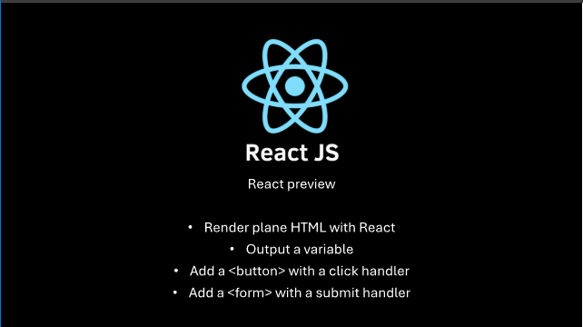
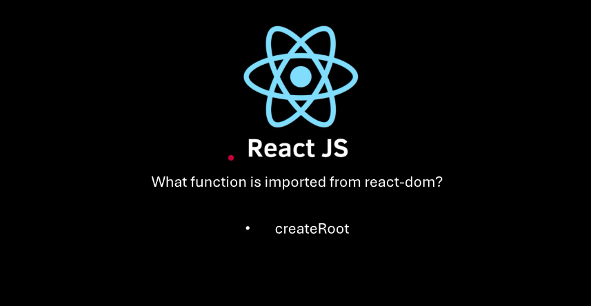
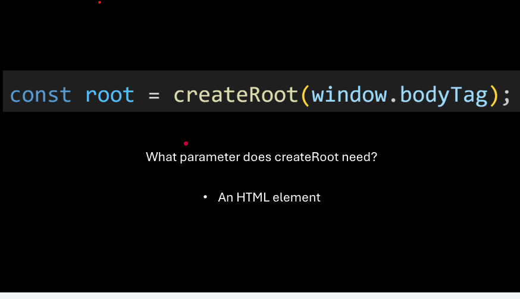
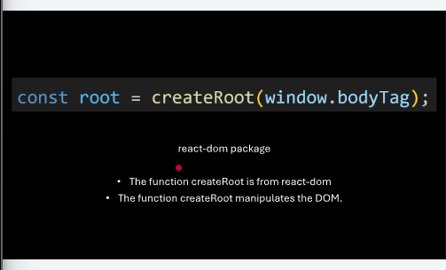
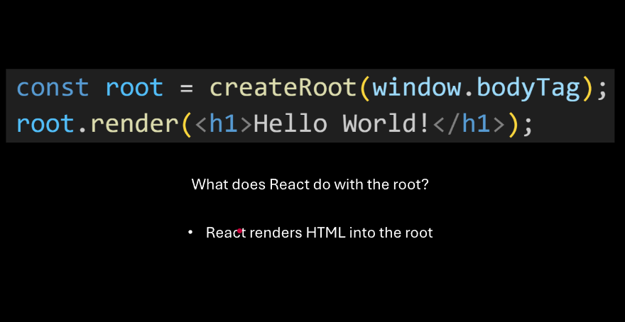
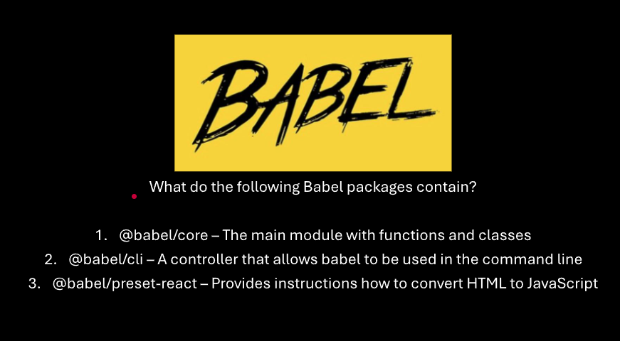
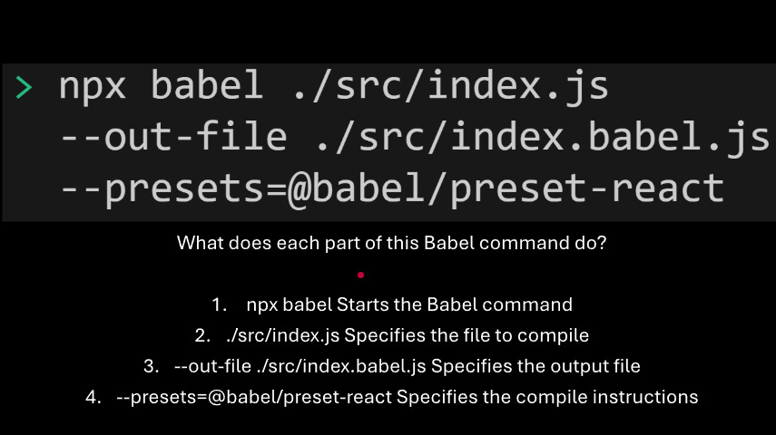
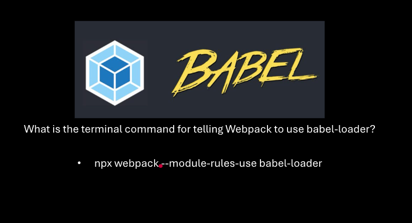
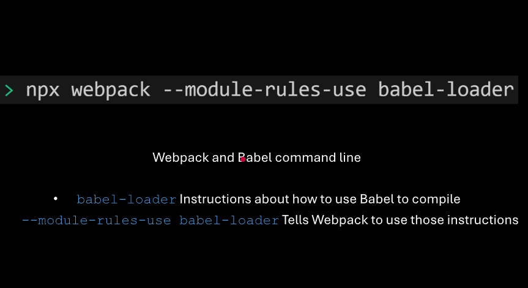
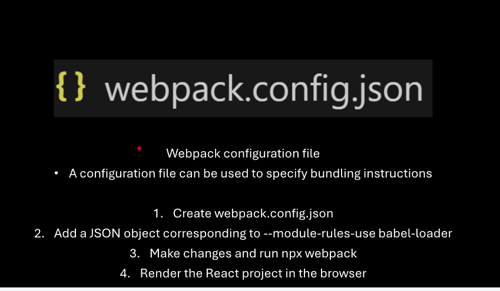

# React

> 
>
> - A node module
> - Creates web pages with JavaScript instead `HTML`
> - `HTML` web pages are static- they don't change
> - `JavaScript` web pages are dynamic - they can change

> ### <font color="slate"> Installation</font>

```
> npm init
> npm install react react-dom
```

> 
>
> - <font color="lightblue">
> - `react` The main react functions and classes.
> - Contains the methods for converting HTML to JavaScript
> - `react-dom` More functions and classes to use react
> - Contains function for manipulating the dom.
> - >   ::Babel replaces HTML with React object::
> 
> ### <ins> DOM= Document object model
- Document Object Model
- Represent HTML as a tree of objects
- Represented by the document object
- The function `creatRoot` is from react-dom
- The function `creatRoot` manipulates the DOM.
>

> 

> ### <font color="lightblue"> React Setup</font>

```js
import { createRoot } from "react-dom/client";
import React from "react";

const root = createRoot(window.bodyTag);
root.render(<h1>Hello World!"</h1>);
```

1. index.html
2. ./src/index.js
3. <script src="./dist/main.js" defer></script>
   - `defer` loads script after the HTML file has rendered all it's elements
4. `creatRoot` needs an `HTML` element
5. React renders HTML into the root
   >  >

### <ins>Babel<ins>

- `HTML` is not valid javascript
- `HTML` must be compiled or convereted to usable `JavaScript`
- Babel is a `JavaScript` compiler
- it can compile `HTML` into browser-compatible `JavaScript`
- - Babel is also a node module
    > - 

### <ins>Compiling the `HTML` to `JavaScript`<ins>

- Copy the `HTML` and paste it into the Babel website
- Copy compiled code into index.js

### <ins>installing Babel<ins>

> `npm install @babel/core @babel/cli @babel/preset-react`

- `@babel/core` The main module with functions and classes
- `@babel/cli` A controller that allows babel to be used in the command line
- `@babel/preset-react` - Provides instructions how to convert `HTML` to `JavaScript`

> 

> ### <ins><font color="slate"> Babel command line<font>

- `npx babel` The main command
- ` ./src/index.js` Specifies the file to compile
- `--out-file ./src/index.babel.js` Specifies the output file
- `--presets=@babel/preset-react` - Specifies the instructions

> ### <font color="slat"> Manually using the file generated by Babel</font>

1.` Rename index.js` to `index.original.js` 2. Rename `index.babel.js` to `index.js` 3. npx webpack

### Babel configuraation file

> 

>  > `babel.config.json`

```json
{
  "presets": ["@babel/preset-react"]
}
```

`npx babel ./src/index.original.js --out-file ./src/index.js`

- A configuration file used to specify compile instructions

1. Create babel.config.json
2. Add "presets": [ "@babel/preset-react" ]
3. Make changes, re-compile with Babel, and re-bundle with Webpack

> ### <font color="slate">Webpack and Babel</font>
>
> 

1. npm install babel-loader
2. Use Webpack file structure and make changes
3. npx webpack --module-rules-use babel-loader
4. Render the React project in the browser

> 

- `babel-loader` nstructions about how to use Babel to compile
- `--module-rules-use babel-loader` Tells Webpack to use those instructions

> 

### <ins>Configure Webpack to use Babel to compile

1. Create `webpack.config.json`
2. Add a JSON object corresponding to `--module-rules-use babel-loader`

```json
{
  "module": {
    "rules": [
      {
        "use": "babel-loader"
      }
    ]
  }
}
```

### <ins>Configure Webpack to watch for changes

1. `npx webpack --watch`
2. Press CRTL + C to exit Webpack

```json
{
  "watch": true
}
```

### <ins>Getting started with React

```js
<p> The Message is: {message}</p>
```

- Use curly braces to escape JavaScript
- Extensions `.js` are not necassary for the import statement
- Event handlers are callback functions (without parentheses)
- The event variable is automatically passed to event handlers

### Debugger modes

`npx webpack --mode development`

- By default, Webpack disables the debugger with production mode
- To enable the debugger, set the mode to development

1. Edit webpack.config.json
2. Add "mode"